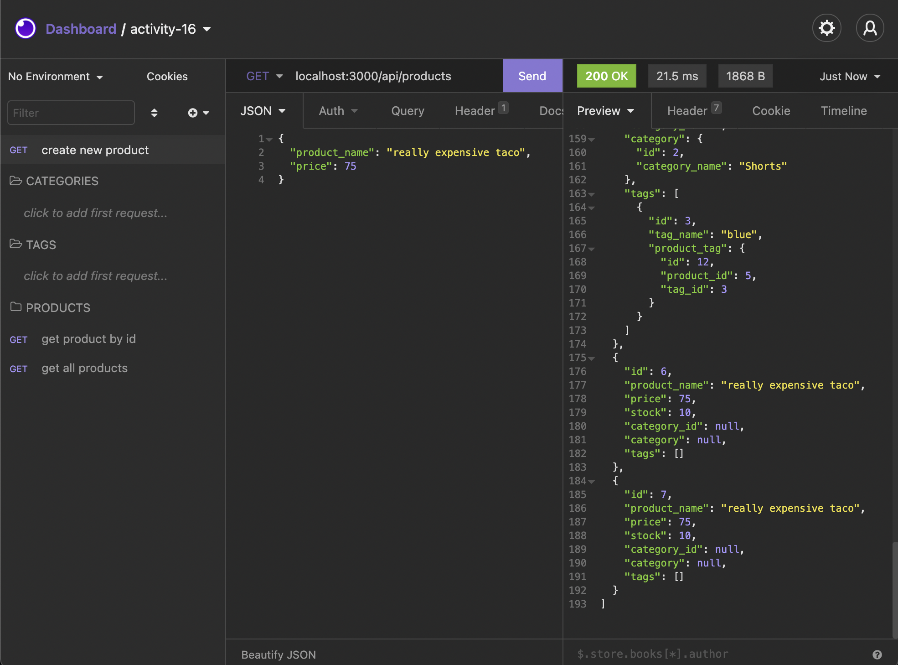
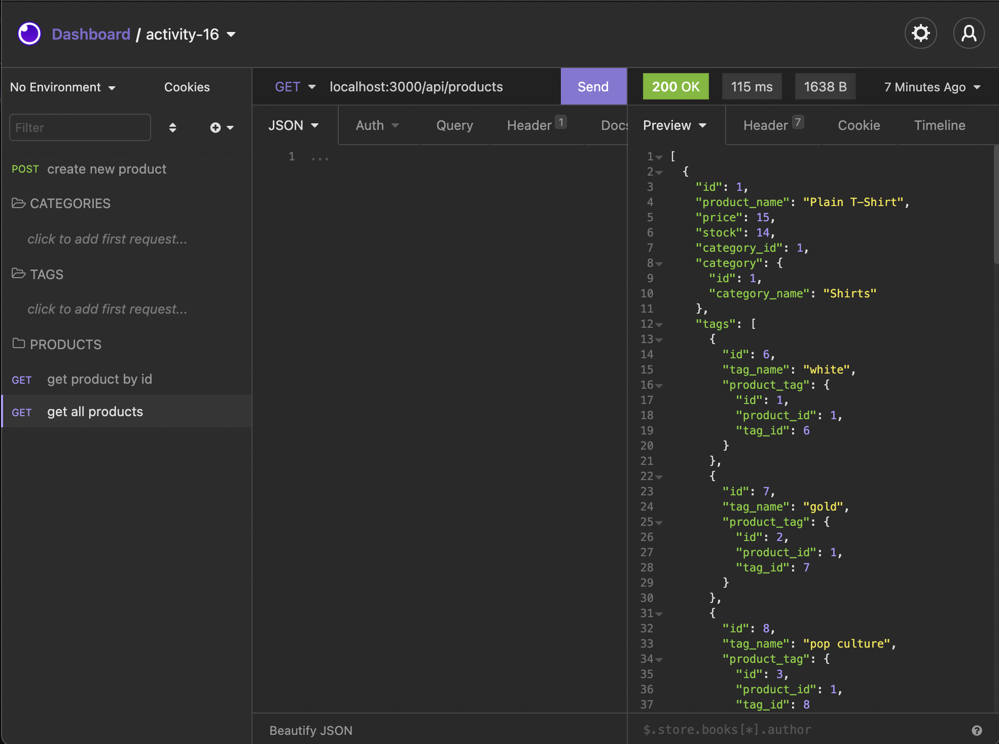
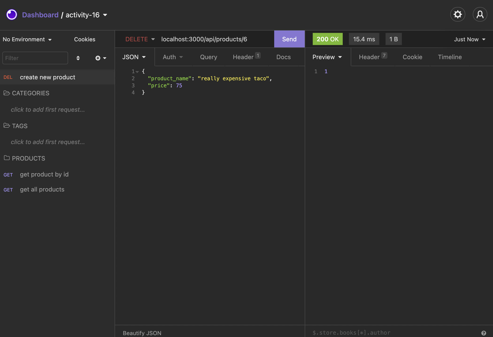
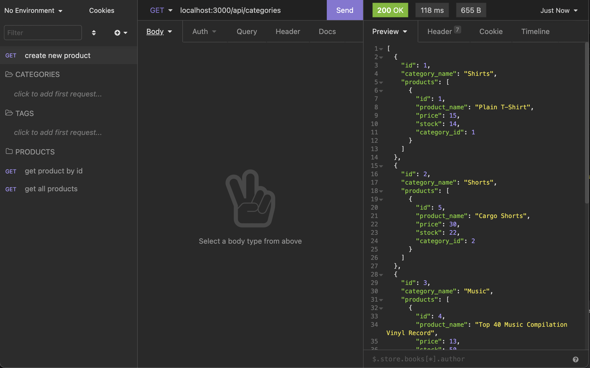
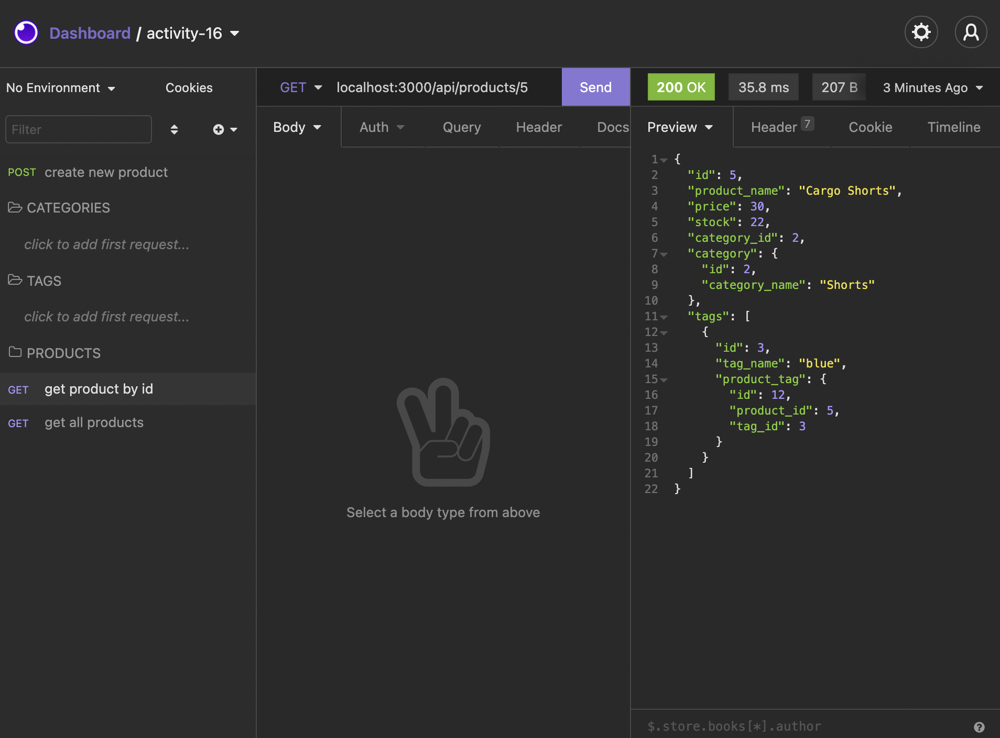
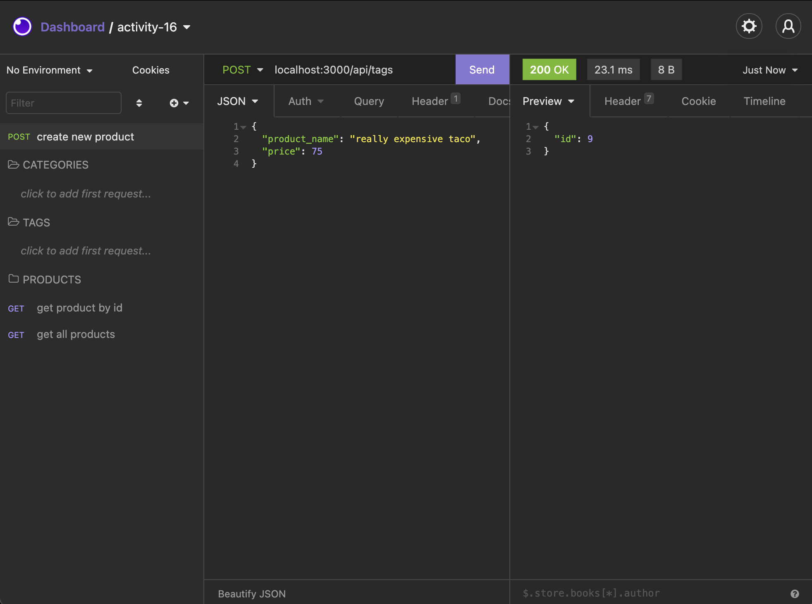
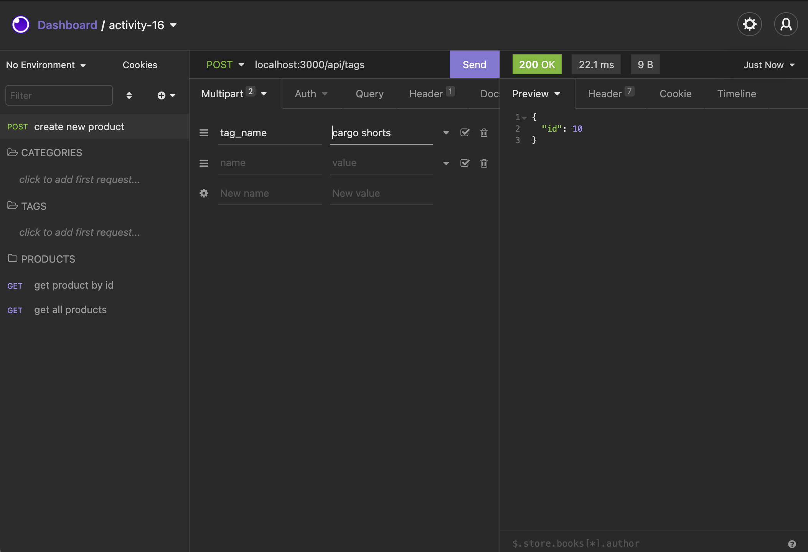
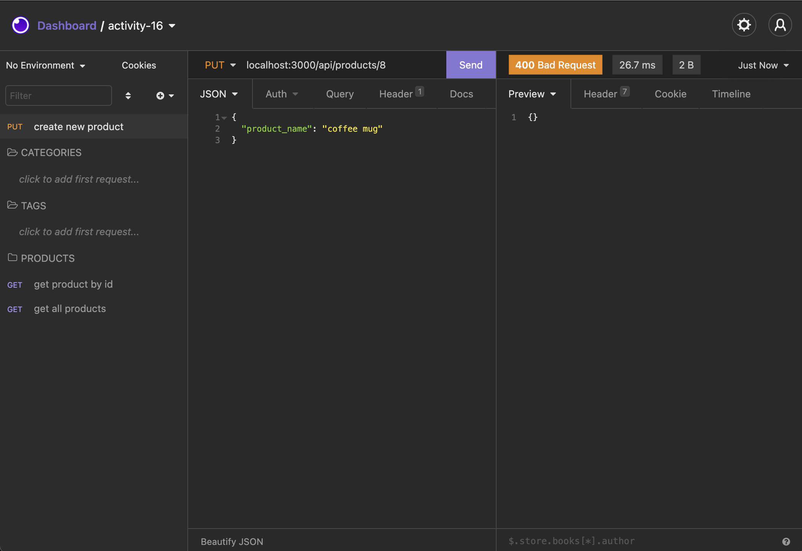
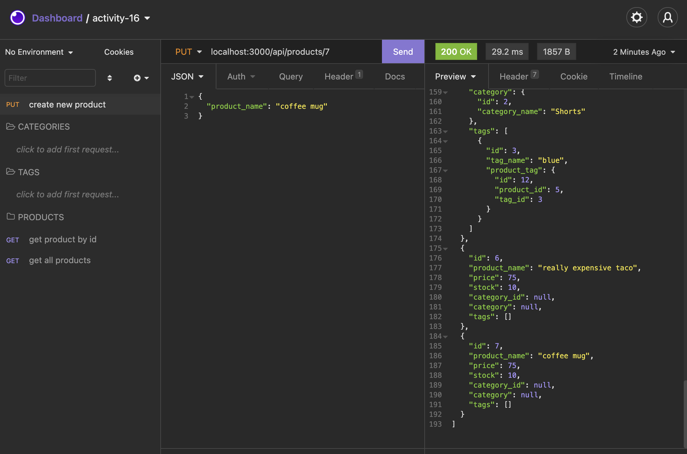

# **E-Commerce Backend**

## **Resources**
[Repository](https://github.com/charlottehulseman/e-commerce-backend)
View images below of interactions with database via Insomnia.

## **Description**
E-commerce backend 

## **Usage Guide**
Use with Insomnia to view database and route information. Must have MySQL installed. Or view images below for an example of interaction with database.

## **Installation Instructions**
Clone this repo to your local system, open an integrated terminal. Add your own `.env` file that includes your username and password as well as `ecommerce_db` for the database name. Next, start MySQL and run `source db/schema.sql` to connect to the database and then type `exit` upon success. To seed the database, type `node seeds` and then start the server with `node server.js`. Finally, navigate to Insomnia and put in localhost:3000/api/ and add `products`, `categories` or `tags` to the end to interact with the database.

View Insomnia interactions below:

**Create Product**

**Get All Products**

**Delete Product**

**Get Categories**

**Get Product by ID**

**Get Tag**

**Get Tag Name**

**Update Product**

## **Contributions**
Charlotte Hulseman
[Github](https://github.com/charlottehulseman)

## **Contact**
For any questions regarding this project, please contact me at cchulseman@gmail.com